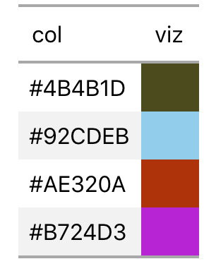

# Colored table in README

``` r
library(tidyverse)

df_colors <- tibble(col = c("#4B4B1D", "#92CDEB", "#AE320A", "#B724D3"), 
                    viz = c(" ", "  ", "   ", "    "))
```

Expected output:

<center>



</center>

## kableExtra

``` r
library(kableExtra)

df_colors %>%
  mutate(viz = cell_spec(viz, background = df_colors$col)) %>%
  kable(escape = FALSE)
```

<table>

<thead>

<tr>

<th style="text-align:left;">

col

</th>

<th style="text-align:left;">

viz

</th>

</tr>

</thead>

<tbody>

<tr>

<td style="text-align:left;">

\#4B4B1D

</td>

<td style="text-align:left;">

<span style="     border-radius: 4px; padding-right: 4px; padding-left: 4px; background-color: #4B4B1D !important;">
</span>

</td>

</tr>

<tr>

<td style="text-align:left;">

\#92CDEB

</td>

<td style="text-align:left;">

<span style="     border-radius: 4px; padding-right: 4px; padding-left: 4px; background-color: #92CDEB !important;">
</span>

</td>

</tr>

<tr>

<td style="text-align:left;">

\#AE320A

</td>

<td style="text-align:left;">

<span style="     border-radius: 4px; padding-right: 4px; padding-left: 4px; background-color: #AE320A !important;">
</span>

</td>

</tr>

<tr>

<td style="text-align:left;">

\#B724D3

</td>

<td style="text-align:left;">

<span style="     border-radius: 4px; padding-right: 4px; padding-left: 4px; background-color: #B724D3 !important;">
</span>

</td>

</tr>

</tbody>

</table>

``` r
df_colors %>%
  mutate(viz = cell_spec(viz, background = df_colors$col)) %>%
  kable() 
```

<table>

<thead>

<tr>

<th style="text-align:left;">

col

</th>

<th style="text-align:left;">

viz

</th>

</tr>

</thead>

<tbody>

<tr>

<td style="text-align:left;">

\#4B4B1D

</td>

<td style="text-align:left;">

\<span style=" border-radius: 4px; padding-right: 4px; padding-left:
4px; background-color: \#4B4B1D \!important;" \> \</span\>

</td>

</tr>

<tr>

<td style="text-align:left;">

\#92CDEB

</td>

<td style="text-align:left;">

\<span style=" border-radius: 4px; padding-right: 4px; padding-left:
4px; background-color: \#92CDEB \!important;" \> \</span\>

</td>

</tr>

<tr>

<td style="text-align:left;">

\#AE320A

</td>

<td style="text-align:left;">

\<span style=" border-radius: 4px; padding-right: 4px; padding-left:
4px; background-color: \#AE320A \!important;" \> \</span\>

</td>

</tr>

<tr>

<td style="text-align:left;">

\#B724D3

</td>

<td style="text-align:left;">

\<span style=" border-radius: 4px; padding-right: 4px; padding-left:
4px; background-color: \#B724D3 \!important;" \> \</span\>

</td>

</tr>

</tbody>

</table>

## gt

``` r
library(gt)

df_colors %>% 
  gt() %>% 
  data_color(columns = vars(viz), colors = df_colors$col)
```

<!--html_preserve-->

<style>html {
  font-family: -apple-system, BlinkMacSystemFont, 'Segoe UI', Roboto, Oxygen, Ubuntu, Cantarell, 'Helvetica Neue', 'Fira Sans', 'Droid Sans', Arial, sans-serif;
}

#qbjskotvij .gt_table {
  display: table;
  border-collapse: collapse;
  margin-left: auto;
  margin-right: auto;
  color: #000000;
  font-size: 16px;
  background-color: #FFFFFF;
  /* table.background.color */
  width: auto;
  /* table.width */
  border-top-style: solid;
  /* table.border.top.style */
  border-top-width: 2px;
  /* table.border.top.width */
  border-top-color: #A8A8A8;
  /* table.border.top.color */
}

#qbjskotvij .gt_heading {
  background-color: #FFFFFF;
  /* heading.background.color */
  border-bottom-color: #FFFFFF;
}

#qbjskotvij .gt_title {
  color: #000000;
  font-size: 125%;
  /* heading.title.font.size */
  padding-top: 4px;
  /* heading.top.padding */
  padding-bottom: 1px;
  border-bottom-color: #FFFFFF;
  border-bottom-width: 0;
}

#qbjskotvij .gt_subtitle {
  color: #000000;
  font-size: 85%;
  /* heading.subtitle.font.size */
  padding-top: 1px;
  padding-bottom: 4px;
  /* heading.bottom.padding */
  border-top-color: #FFFFFF;
  border-top-width: 0;
}

#qbjskotvij .gt_bottom_border {
  border-bottom-style: solid;
  /* heading.border.bottom.style */
  border-bottom-width: 2px;
  /* heading.border.bottom.width */
  border-bottom-color: #A8A8A8;
  /* heading.border.bottom.color */
}

#qbjskotvij .gt_column_spanner {
  border-bottom-style: solid;
  border-bottom-width: 2px;
  border-bottom-color: #A8A8A8;
  padding-top: 4px;
  padding-bottom: 4px;
}

#qbjskotvij .gt_col_heading {
  color: #000000;
  background-color: #FFFFFF;
  /* column_labels.background.color */
  font-size: 16px;
  /* column_labels.font.size */
  font-weight: initial;
  /* column_labels.font.weight */
  vertical-align: middle;
  padding: 10px;
  margin: 10px;
}

#qbjskotvij .gt_sep_right {
  border-right: 5px solid #FFFFFF;
}

#qbjskotvij .gt_group_heading {
  padding: 8px;
  color: #000000;
  background-color: #FFFFFF;
  /* row_group.background.color */
  font-size: 16px;
  /* row_group.font.size */
  font-weight: initial;
  /* row_group.font.weight */
  border-top-style: solid;
  /* row_group.border.top.style */
  border-top-width: 2px;
  /* row_group.border.top.width */
  border-top-color: #A8A8A8;
  /* row_group.border.top.color */
  border-bottom-style: solid;
  /* row_group.border.bottom.style */
  border-bottom-width: 2px;
  /* row_group.border.bottom.width */
  border-bottom-color: #A8A8A8;
  /* row_group.border.bottom.color */
  vertical-align: middle;
}

#qbjskotvij .gt_empty_group_heading {
  padding: 0.5px;
  color: #000000;
  background-color: #FFFFFF;
  /* row_group.background.color */
  font-size: 16px;
  /* row_group.font.size */
  font-weight: initial;
  /* row_group.font.weight */
  border-top-style: solid;
  /* row_group.border.top.style */
  border-top-width: 2px;
  /* row_group.border.top.width */
  border-top-color: #A8A8A8;
  /* row_group.border.top.color */
  border-bottom-style: solid;
  /* row_group.border.bottom.style */
  border-bottom-width: 2px;
  /* row_group.border.bottom.width */
  border-bottom-color: #A8A8A8;
  /* row_group.border.bottom.color */
  vertical-align: middle;
}

#qbjskotvij .gt_striped {
  background-color: #f2f2f2;
}

#qbjskotvij .gt_from_md > :first-child {
  margin-top: 0;
}

#qbjskotvij .gt_from_md > :last-child {
  margin-bottom: 0;
}

#qbjskotvij .gt_row {
  padding: 8px;
  /* row.padding */
  margin: 10px;
  vertical-align: middle;
}

#qbjskotvij .gt_stub {
  border-right-style: solid;
  border-right-width: 2px;
  border-right-color: #A8A8A8;
  padding-left: 12px;
}

#qbjskotvij .gt_summary_row {
  color: #000000;
  background-color: #FFFFFF;
  /* summary_row.background.color */
  padding: 8px;
  /* summary_row.padding */
  text-transform: inherit;
  /* summary_row.text_transform */
}

#qbjskotvij .gt_grand_summary_row {
  color: #000000;
  background-color: #FFFFFF;
  /* grand_summary_row.background.color */
  padding: 8px;
  /* grand_summary_row.padding */
  text-transform: inherit;
  /* grand_summary_row.text_transform */
}

#qbjskotvij .gt_first_summary_row {
  border-top-style: solid;
  border-top-width: 2px;
  border-top-color: #A8A8A8;
}

#qbjskotvij .gt_first_grand_summary_row {
  border-top-style: double;
  border-top-width: 6px;
  border-top-color: #A8A8A8;
}

#qbjskotvij .gt_table_body {
  border-top-style: solid;
  /* table_body.border.top.style */
  border-top-width: 2px;
  /* table_body.border.top.width */
  border-top-color: #A8A8A8;
  /* table_body.border.top.color */
  border-bottom-style: solid;
  /* table_body.border.bottom.style */
  border-bottom-width: 2px;
  /* table_body.border.bottom.width */
  border-bottom-color: #A8A8A8;
  /* table_body.border.bottom.color */
}

#qbjskotvij .gt_footnote {
  font-size: 90%;
  /* footnote.font.size */
  padding: 4px;
  /* footnote.padding */
}

#qbjskotvij .gt_sourcenote {
  font-size: 90%;
  /* sourcenote.font.size */
  padding: 4px;
  /* sourcenote.padding */
}

#qbjskotvij .gt_center {
  text-align: center;
}

#qbjskotvij .gt_left {
  text-align: left;
}

#qbjskotvij .gt_right {
  text-align: right;
  font-variant-numeric: tabular-nums;
}

#qbjskotvij .gt_font_normal {
  font-weight: normal;
}

#qbjskotvij .gt_font_bold {
  font-weight: bold;
}

#qbjskotvij .gt_font_italic {
  font-style: italic;
}

#qbjskotvij .gt_super {
  font-size: 65%;
}

#qbjskotvij .gt_footnote_glyph {
  font-style: italic;
  font-size: 65%;
}
</style>

<div id="qbjskotvij" style="overflow-x:auto;">

<!--gt table start-->

<table class="gt_table">

<tr>

<th class="gt_col_heading gt_left" rowspan="1" colspan="1">

col

</th>

<th class="gt_col_heading gt_left" rowspan="1" colspan="1">

viz

</th>

</tr>

<tbody class="gt_table_body">

<tr>

<td class="gt_row gt_left">

\#4B4B1D

</td>

<td class="gt_row gt_left" style="background-color:#4B4B1D;color:#FFFFFFFF;">

</td>

</tr>

<tr>

<td class="gt_row gt_left gt_striped">

\#92CDEB

</td>

<td class="gt_row gt_left gt_striped" style="background-color:#92CDEB;color:#000000FF;">

</td>

</tr>

<tr>

<td class="gt_row gt_left">

\#AE320A

</td>

<td class="gt_row gt_left" style="background-color:#AE320A;color:#FFFFFFFF;">

</td>

</tr>

<tr>

<td class="gt_row gt_left gt_striped">

\#B724D3

</td>

<td class="gt_row gt_left gt_striped" style="background-color:#B724D3;color:#FFFFFFFF;">

</td>

</tr>

</tbody>

</table>

<!--gt table end-->

</div>

<!--/html_preserve-->

## DT

``` r
library(DT)

df_colors %>%
  datatable() %>%
  formatStyle(columns = "viz", valueColumns = "col",
              backgroundColor = styleEqual(df_colors$col, df_colors$col))
```

    ## PhantomJS not found. You can install it with webshot::install_phantomjs(). If it is installed, please make sure the phantomjs executable can be found via the PATH variable.

<!--html_preserve-->

<div id="htmlwidget-3afb8787b98b3e09d4a6" class="datatables html-widget" style="width:100%;height:auto;">

</div>

<script type="application/json" data-for="htmlwidget-3afb8787b98b3e09d4a6">{"x":{"filter":"none","data":[["1","2","3","4"],["#4B4B1D","#92CDEB","#AE320A","#B724D3"],[" ","  ","   ","    "]],"container":"<table class=\"display\">\n  <thead>\n    <tr>\n      <th> <\/th>\n      <th>col<\/th>\n      <th>viz<\/th>\n    <\/tr>\n  <\/thead>\n<\/table>","options":{"order":[],"autoWidth":false,"orderClasses":false,"columnDefs":[{"orderable":false,"targets":0}],"rowCallback":"function(row, data) {\nvar value=data[1]; $(this.api().cell(row, 2).node()).css({'background-color':value == '#4B4B1D' ? '#4B4B1D' : value == '#92CDEB' ? '#92CDEB' : value == '#AE320A' ? '#AE320A' : value == '#B724D3' ? '#B724D3' : ''});\n}"}},"evals":["options.rowCallback"],"jsHooks":[]}</script>

<!--/html_preserve-->
